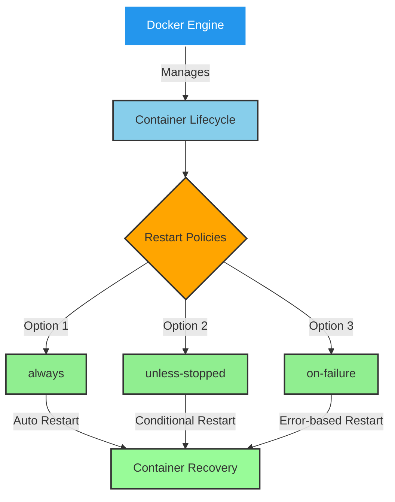
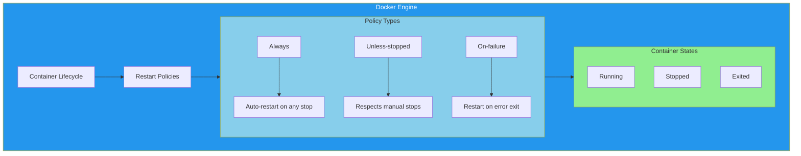

# 🐳 Docker Container Lifecycle & Restart Policies Explorer

[](https://github.com/TheToriqul/docker-restart-policies)
[](https://github.com/TheToriqul/docker-restart-policies/stargazers)
[](https://www.docker.com/)
[](https://www.gnu.org/software/bash/)
[](https://github.com/TheToriqul/docker-restart-policies#readme)

## 📋 Overview

This project explores Docker container lifecycle management with a focus on implementing and understanding different restart policies. Through hands-on implementation, I've developed a comprehensive understanding of container resilience and self-healing mechanisms. This knowledge is essential for building robust containerized applications in production environments.

## 🏗 Technical Architecture

Docker restart policies form a crucial part of container orchestration, providing automated container recovery mechanisms.




## 💻 Technical Stack

- **Container Runtime**: Docker Engine
- **Scripting**: Bash shell scripting
- **Operating System**: Linux-based systems
- **Documentation**: Markdown
- **Version Control**: Git

## ⭐ Key Features

1. Container Lifecycle Management
   - Automated restart mechanisms
   - Process signal handling
   - Container state monitoring

2. Restart Policy Implementation
   - `always` policy configuration
   - `unless-stopped` policy setup
   - `on-failure` policy management

3. Monitoring & Logging
   - Real-time container status tracking
   - Log inspection capabilities
   - Resource usage monitoring

4. Error Handling
   - Graceful termination handling
   - Force kill scenarios
   - Custom timeout configurations

5. Container Cleanup
   - Automated cleanup procedures
   - Volume management
   - Resource optimization

## 📚 Learning Journey

### Technical Mastery:

1. Docker container lifecycle management
2. Process signal handling in containerized environments
3. Container monitoring and logging strategies
4. Bash script automation for Docker operations
5. Container resource management and optimization

### Professional Development:

1. System architecture design
2. Documentation writing
3. Shell scripting proficiency
4. Problem-solving in containerized environments
5. Infrastructure resilience planning

## 🔄 Future Enhancements

<details>
<summary>View Planned Improvements</summary>

1. Integration with Docker Compose for multi-container scenarios
2. Custom health check implementations
3. Metrics collection and visualization
4. Advanced logging configurations
5. Network resilience testing
6. Resource limit optimization
</details>

## ⚙️ Installation

<details>
<summary>View Installation Details</summary>

### Prerequisites

- Docker Engine installed
- Bash shell environment
- Git for version control

### Setup Steps

1. Clone the repository:
   ```bash
   git clone https://github.com/TheToriqul/docker-restart-policies.git
   ```

2. Navigate to the project directory:
   ```bash
   cd docker-restart-policies
   ```

</details>

## 📖 Usage Guide

<details>
<summary>View Usage Details</summary>

### Basic Usage

Run the example scripts to explore different restart policies:

```bash
From script.sh file
```

### Advanced Features

Each script demonstrates different aspects of Docker restart policies:
- Process signal handling
- Container state monitoring
- Resource cleanup

</details>

## 📫 Contact

- 📧 Email: toriqul.int@gmail.com
- 📱 Phone: +65 8936 7705, +8801765 939006

## 🔗 Project Links

- [GitHub Repository](https://github.com/TheToriqul/docker-restart-policies)
- [Portfolio](https://github.com/TheToriqul)

## 👏 Acknowledgments

- [Poridhi for excellent labs](https://poridhi.io/)
- [Docker Community for excellent documentation](https://docs.docker.com/)
- Open Source Community for knowledge sharing

Feel free to explore, modify, and build upon this configuration as part of my learning journey. You're also welcome to learn from it, and I wish you the best of luck!